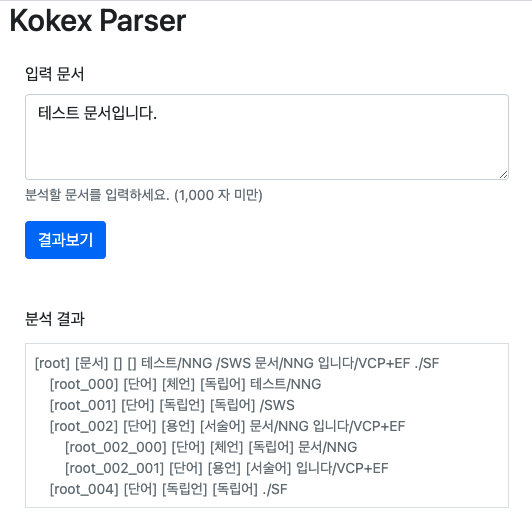

# Parse

입력 문서가 어떻게 파싱되는지 분석 트리를 출력합니다.

```python
import kokex

print(
    kokex.parse("첫 번째 문서입니다. 여러 문장을 포함할 수 있습니다.", debug=False)
)

print(
    kokex.parse("첫 번째 문서입니다. 여러 문장을 포함할 수 있습니다.", debug=True)
)
```
출력은 아래와 같습니다. `debug` 입력 값이 `True`가 되면 추가 정보가 출력되는 것을 확인하세요.

```
[root] 첫 번째 문서입니다. 여러 문장을 포함할 수 있습니다.
	[root_000] 첫
	[root_001]  
	[root_002] 번째
		[root_002_000] 번
		[root_002_001] 째
... 생략

[root] [문서] [] [] 첫/MM  /SWS 번/NNBC 째/XSN  /SWS 문서/NNG 입니다/VCP+EF ./SF  /SWS 여러/MM  /SWS 문장/NNG 을/JKO  /SWS 포함/NNG 할/XSV+ETM  /SWS 수/NNB  /SWS 있/VV 습니다/EF ./SF
	[root_000] [단어] [수식언] [관형어] 첫/MM
	[root_001] [단어] [독립언] [독립어]  /SWS
	[root_002] [단어] [체언] [독립어] 번/NNBC 째/XSN
		[root_002_000] [단어] [체언] [독립어] 번/NNBC
		[root_002_001] [단어] [체언] [독립어] 째/XSN
... 생략
```

이 때의 출력 형식은 `[ID] [문서위계] [5언] [7성분] 단어/품사` 형태입니다.
`문서위계`는 문서 / 문장 / 절 / 구 / 단어, `5언`은 체언 / 용언 / 수식언 / 관계언 / 독립언, 
`7성분`은 주어 / 서술어 / 목적어 / 보어 / 부사어 / 관형어 / 독립어 로 구성됩니다. 
품사는 [Mecab 품사 태그](https://docs.google.com/spreadsheets/d/1-9blXKjtjeKZqsf4NzHeYJCrr49-nXeRF6D80udfcwY/edit#gid=589544265) 를 참고해주세요.


## Server
도커를 이용하여 kokex server를 실행시켰다면 `http://localhost/parse` 에 접근해서 결과를 확인할 수 있습니다.
아래는 테스트 문장의 입력 결과입니다.




## Patterns (API 에서만 지원)
parse 함수에서는 정규식 패턴을 입력하여 사용자 정의 형태소를 추가할 수 있습니다. 아래의 두 가지 예시를 비교해보세요.
```python
import kokex

print(kokex.parse("kokex 0.0.11 버전에서는 패턴 규칙을 추가했습니다.", debug=True))

# [root_000_000_002] [단어] [독립언] [독립어] 0/SN
# [root_000_000_003] [단어] [독립언] [독립어] ./SY
# [root_000_000_004] [단어] [독립언] [독립어] 0/SN
# [root_000_000_005] [단어] [독립언] [독립어] ./SY
# [root_000_000_006] [단어] [독립언] [독립어] 11/SN

print(kokex.parse("kokex 0.0.11 버전에서는 패턴 규칙을 추가했습니다.", debug=True,
                  custom_patterns=[{'pattern': r'\d+.\d+.\d+', 'tag': 'PT001'}]))

# [root_000_000_002] [단어] [독립언] [독립어] 0.0.11/PT001
```
